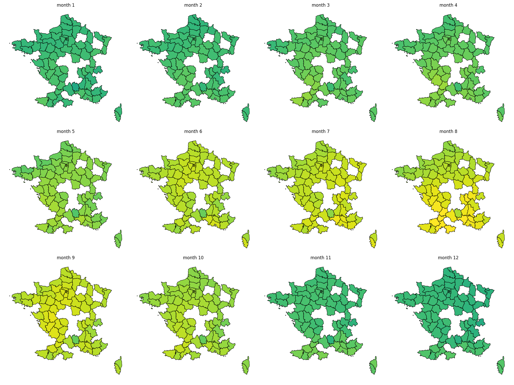

# Weather heatmap

Carto montrant le nombre d'heure dont la température est entre T_min et T_max, par mois. 

## Data

Données climatologiques de base - horaires

https://meteo.data.gouv.fr/datasets/6569b4473bedf2e7abad3b72

https://object.files.data.gouv.fr/meteofrance/data/synchro_ftp/BASE/HOR/H_01_1850-1859.csv.gz

https://object.files.data.gouv.fr/meteofrance/data/synchro_ftp/BASE/HOR/H_31_2010-2019.csv.gz